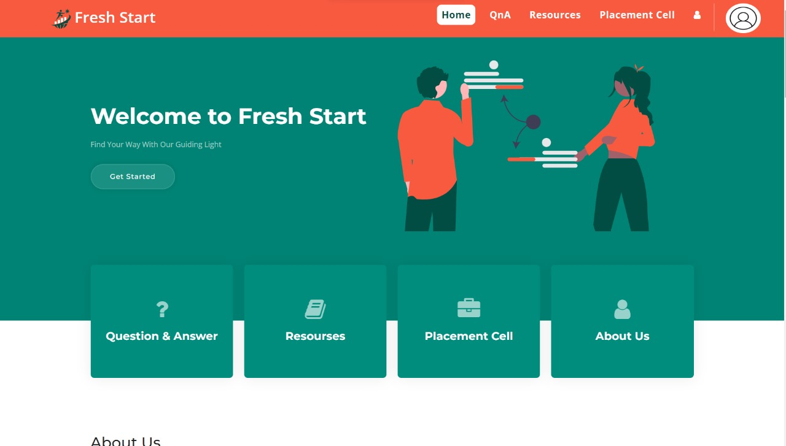
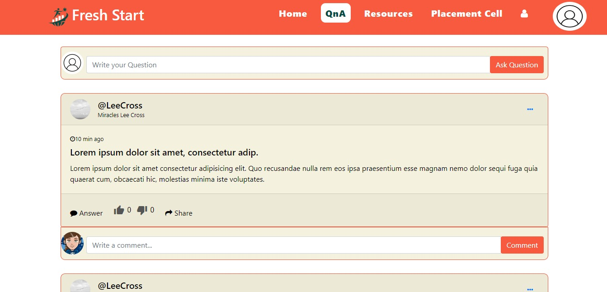

# FreshStart

## Overview
Platform for students transitioning from lower to higher semesters.

## Features
List the key features of your app. This can include functionalities like:
- Student question submission
- Senior student answers
- Academic planner, etc.

### Prerequisites
You must have node.js installed in your environment, as well as the MySQL server.

## Getting Started
clone this repository on your machine and run <mark>"npm install"</mark> to install all the required libraries.
after that run <mark>"npm start"</mark> to start the server.
Go to the url given in the console (e.g. http://localhost:8000)

### NOTE
The App is still in developing phase. So, it may not work accordingly.

### Snapshots

